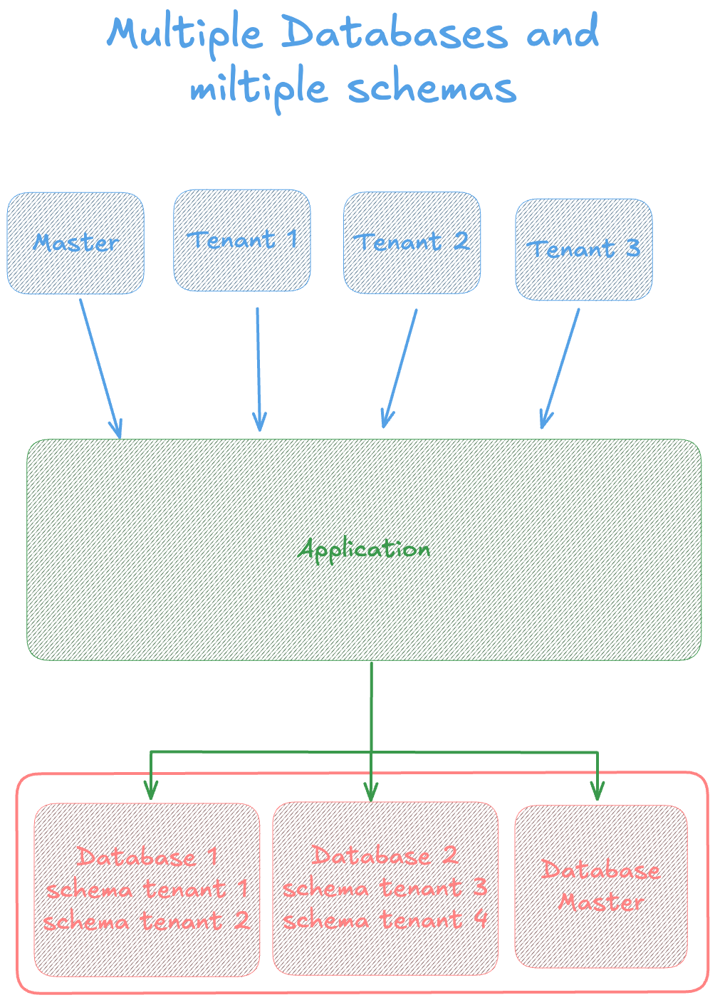

# Multitenant Spring Boot Application

This is a sample application that demonstrates how to build a multitenant application using Spring Boot.

This example uses a separete database for each tenant.<br/>



## Running the application

### Using Docker
execute docker-compose up in the root directory of the project: **sandbox/services/** <br/>
`docker-compose up`

## 1 - Create database

To persist database, the application uses a database called `master`.
```curl
curl --location 'localhost:8080/database' \
--header 'Content-Type: application/json' \
--data 'db1'
```
List all databases
```curl
curl --location 'localhost:8080/database' \
--data ''
```
 execute sql to create a database, use the following curl command:
```curl
curl --location --request POST 'localhost:8080/update-tenants/create-database' \
--data ''
```

## 2 - Create schema

To persist schema, the application uses a database called `master`.
```curl
curl --location 'localhost:8080/schema' \
--header 'Content-Type: application/json' \
--data '{
    "schemaName": "schema1",
    "databaseName": "db1"
}'
```

See that `databaseName` is the name of the database that the schema will be created in.

List all databases
```curl
curl --location 'localhost:8080/schema' \
--data ''
```
execute sql to create a schemas, use the following curl command:
```curl
curl --location --request POST 'localhost:8080/update-tenants/create-schema' \
--data ''
```

## 3 - Create update tenants
This endpoint define url, username and password to connect to the tenant database.
```
curl --location 'localhost:8080/tenants' \
--header 'Content-Type: application/json' \
--data '{
    "name": "cliente13",
    "url": "jdbc:postgresql://localhost:5432/db1",
    "tenantName": "db1",
    "schemaName" : "schema3",
    "username": "g2dev",
    "password" : "g2dev-master"
}'
```

list all tenants
```curl
curl --location 'localhost:8080/tenants'
```

update tenants - this endpoint will create a connection to the tenant database and execute scripts with flyway.
```curl
curl --location --request PUT 'localhost:8080/update-tenants' \
--data ''
```

### Test application - Curl

use the following curl commands to test the application
See that the header `X-TenantID` is used to identify the tenant. `tenant_1` or `tenant_2`

GET
````
curl --location 'localhost:8080/employee' \
--header 'X-TenantID: tenant_2'
````
POST
````
curl --location 'localhost:8080/employee' \
--header 'X-TenantID: tenant_2' \
--header 'Content-Type: application/json' \
--data 'tenant22'
````


