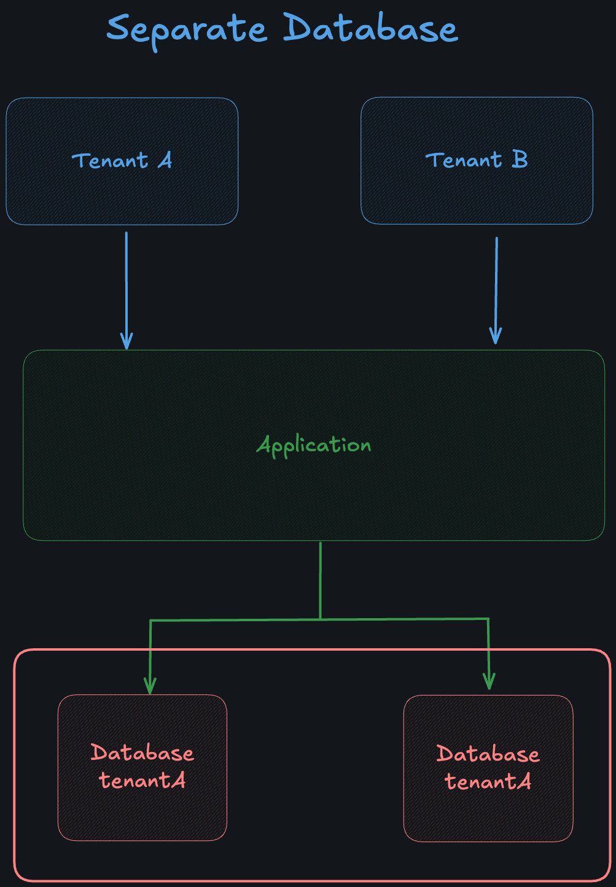

# Multitenant Spring Boot Application

This is a sample application that demonstrates how to build a multitenant application using Spring Boot.

This example uses a separete database for each tenant.<br/>



## Running the application

### Using Docker
execute docker-compose up in the root directory of the project: **sandbox/services/** <br/>
`docker-compose up`

#### Create two databases
`tenant1` and `tenant2`

### Test application - Curl

use the following curl commands to test the application
See that the header `X-TenantID` is used to identify the tenant. `tenant_1` or `tenant_2`

GET
````
curl --location 'localhost:8080/employee' \
--header 'X-TenantID: tenant_2'
````
POST
````
curl --location 'localhost:8080/employee' \
--header 'X-TenantID: tenant_2' \
--header 'Content-Type: application/json' \
--data 'tenant22'
````


